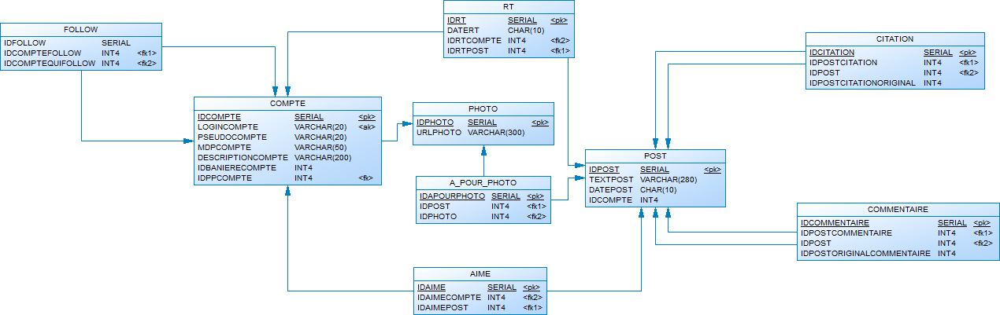

# ProjetX_CREPON_ROB_STAPLETON_TROUBA

## 🚀 Installation et Lancement du Projet

### Prérequis
Avant de lancer le projet, assurez-vous d'avoir installé :
- [Docker](https://www.docker.com/)
- [Docker Compose](https://docs.docker.com/compose/install/)

### Étapes d'installation
1. **Cloner le dépôt Git**
   ```sh
   git clone https://github.com/AlexiStapleton/ProjetX_CREPON_ROB_STAPLETON_TROUBA.git
   cd ProjetX_CREPON_ROB_STAPLETON_TROUBA
   ```

2. **Lancer les services Docker (base de données, backend, etc.)**
   ```sh
   docker-compose up -d --build
   ```

### Accès à l'application
L'application est accessible via l'URL : [http://localhost:12586](http://localhost:12586)

---

## 🛠 Structure et Organisation du Projet

```
ProjetX/
│── ressources/         # Code du projet
│── init.sql            # Scripts SQL
│── docker-compose.yml  # Configuration Docker
│── Dockerfile          # Configuration image Laravel
│── README.md           # Documentation du projet
```

### 📌 Modélisation de la base de données



---

## 👥 Équipe de développement

| Nom                | Rôle                   |
|--------------------|------------------------|
| Alexis Stapleton   | Backend Developer      |
| Crepon Baptiste    | Database/Docker Manager|
| Rob Elioth         | Backend Developer      |
| Trouba Maël        | Frontend Developer     |

